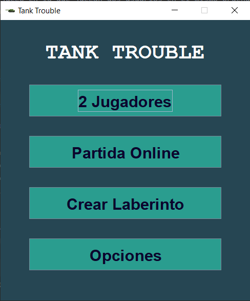
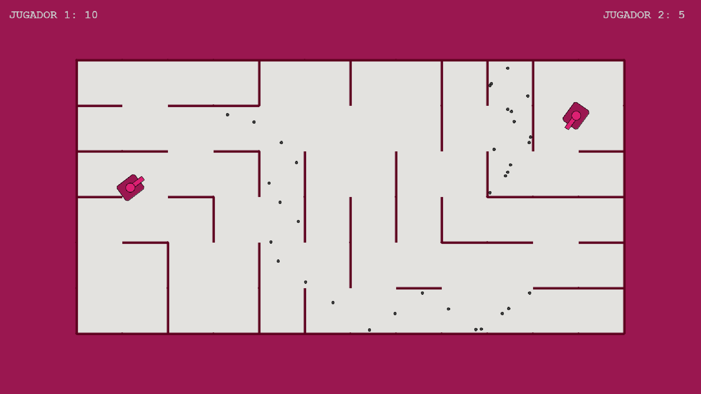
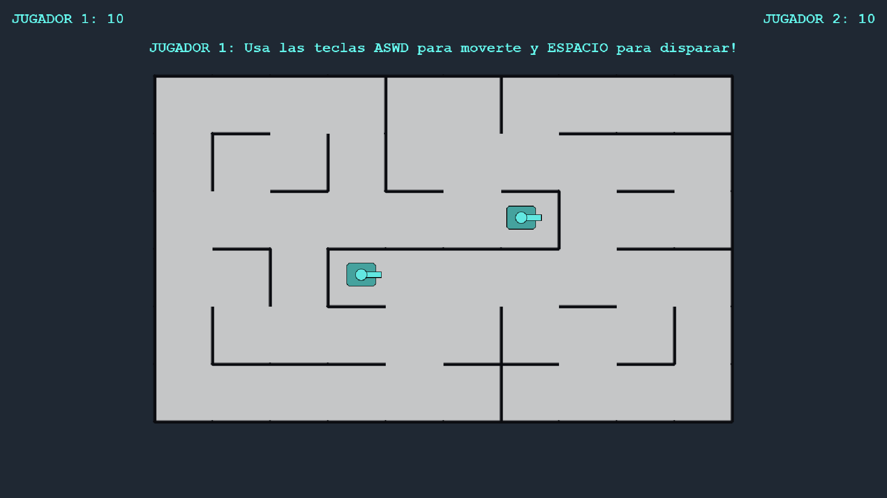
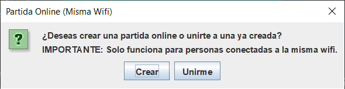
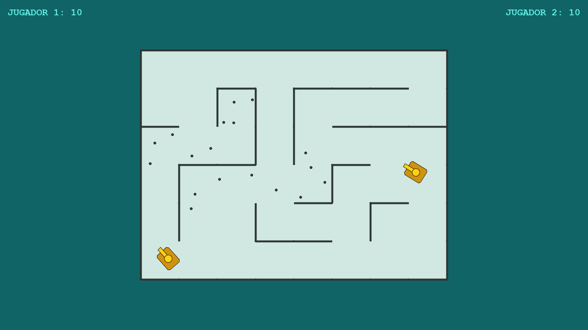
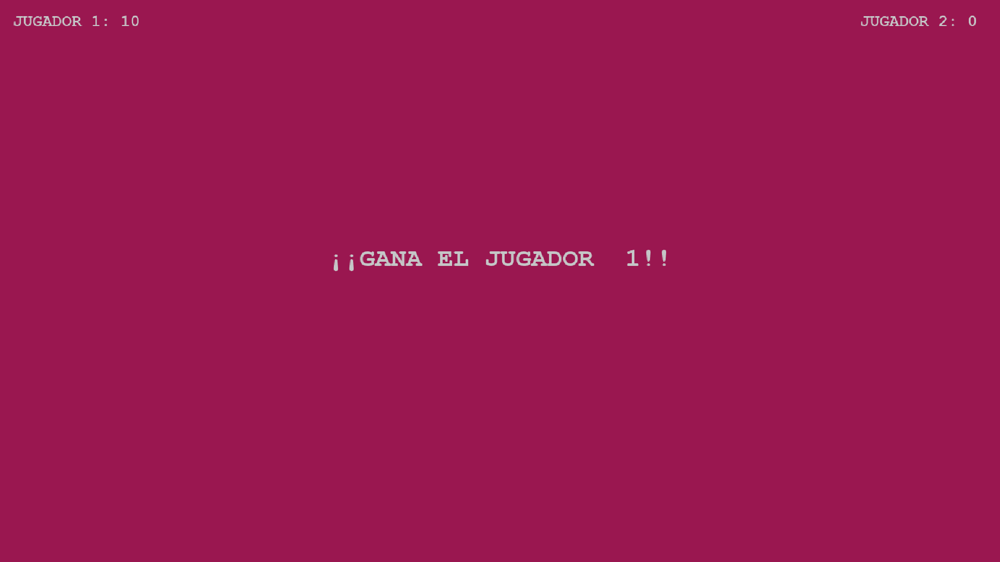
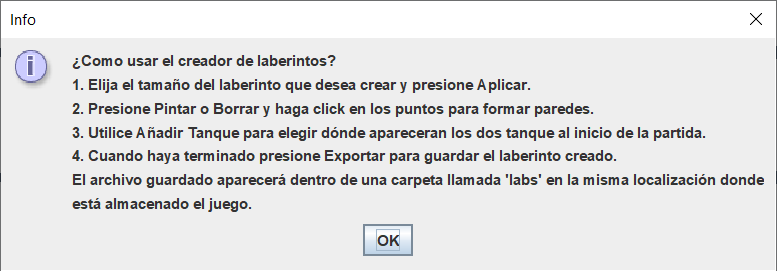
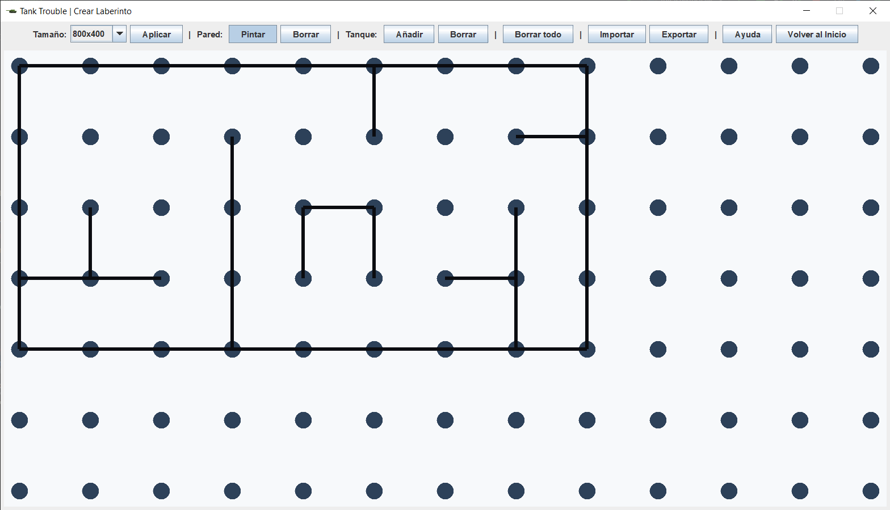
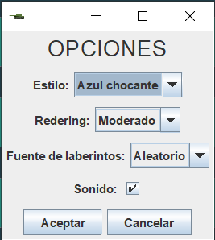

# TankTrouble

### Ventana de Inicio

Ventana que aparece al iniciar el programa, desde la que se puede, entre otras cosas, iniciar el juego.

### 2 Jugadores

Modalidad de juego en la que juegan dos usuarios en el mismo ordenador. 
- El primer usuario controlorá su tanque utilizando las teclas **ASDW** para dirección y el **espacio** para disparar.
- El segundo usuario controlará su tanque utilizandos las **flechas** para dirección y la letra **M** para disparar.

Para voler a la pantalla de Inicio presiona la tecla **Esc**.

### Partida Online (Misma Wifi)

Esta modalidad de juego permite que dos usuarios jueguen cada uno en su ordenador. Para utilizar esta modalidad de juego 
ambos usuarios presionarán **Partida Online**. Aparecerá la siguiente ventana:

- Uno de ellos presionará **Crear** y deberá darle al otro usuario el código que aparece 
en su pantalla.
- El otro presionará **Unirme** e introducirá el código que le ha comunicado el otro usuario.

*Nota: Este código es en realidad los dos últimos  dígitos de la dirección IP Wifi. (192.168.1.XX). En caso de no tener
este formato también es posible introducir la dirección IP entera.*

Para voler a la pantalla de Inicio presiona la tecla **Esc**.

### Creador de Laberintos

El juego se desarrolla en un laberinto, que se almacenan en archivos *.json*. El juego viene equipado con 13 laberintos,
almacenados en la carpeta de recursos.

Sin embargo, el usuario también puede crear sus propios laberintos, que deberán almacenarse en la carpeta **labs**.

1. El primer paso para crear un laberinto es seleccionar un **tamaño** de los permitidos.
2. A continuación, podrá crear las paredes internas haciendo click en los botones de **Pintar** y **Borrar** del menú
Pared. Para pintar una pared haz click en el primer punto (que deberá cambiar de color) y a continuación en el segundo.
3. Después debe utilizar la opción de **Pintar tanque** para seleccionar la posición inicial de los tanques
al comienzo del juego.
4. Por último debe exportar el laberinto creado. 

*Es recomendable no introducir nombre del archivo a exportar y utilizar
el nombre por defecto (labn.json) donde n es un entero.*

### Opciones

En esta ventanta se pueden configurar algunas opciones del programa.

- **Estilo**: gama de colores del juego.
- **Rendering**: hay tres niveles.Cuando más elevado más nitidez tendrá el juego pero puede perder velocidad.
- **Fuente de laberintos**: si los laberintos a los que se juegan provienen de la memoria interna, la enterna o de ambas.
*En caso de Partida Online se seleccionarán siempre de la memoria interna.*
- **Sonido**: si está activado

### Estructura de los archivos

- **src**: estructura de paquetes (archivos .java)
- **res**: recursos utilizados
- **lib**: librerías utilizadas
- **javadoc**: documentación  
- **screenshoots**: capturas del programa